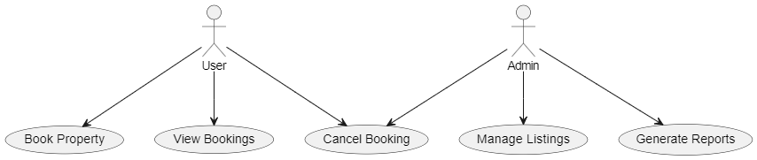

# Requirement Analysis in Software Development
This repository focuses on understanding and documenting software requirements for successful project execution. It is a guide to the Requirement Analysis phase in the Software Development Lifecycle (SDLC).
## What is Requirement Analysis?
Requirement Analysis is the process of identifying, documenting, and managing the needs and expectations of stakeholders for a software project. It ensures that the development team clearly understands what is required, laying the groundwork for a successful project.
## Why is Requirement Analysis Important?
1. **Avoid Miscommunication:** It ensures that the development team and stakeholders are aligned on the project's scope and deliverables.
2. **Reduces Risks:** Identifying potential issues early saves time and resources.
3. **Enhances Efficiency:** Clear requirements streamline the development process, minimizing rework and delays.
## Key Activities in Requirement Analysis
- **Requirement Gathering:** Collecting information from stakeholders.
- **Requirement Elicitation:** Clarifying and expanding on collected information.
- **Requirement Documentation:** Structuring requirements into clear documentation.
- **Requirement Analysis and Modeling:** Using tools and diagrams to analyze and model requirements.
- **Requirement Validation:** Ensuring that requirements meet stakeholder needs.
## Types of Requirements

### Functional Requirements
These describe the system's features and functionalities:
- Example: Allow users to search for available bookings.

### Non-functional Requirements
These define the system's performance and usability:
- Example: The system must handle 10,000 concurrent users.
## Use Case Diagrams
Use Case Diagrams visually represent system interactions, showing actors and use cases.

### Example Diagram

## Use Case Diagrams
Use Case Diagrams visually represent system interactions, showing actors and use cases.

### Example Diagram

## Acceptance Criteria
Acceptance Criteria define the conditions a feature must meet to be considered complete. It ensures alignment between developers and stakeholders.

### Example: Checkout Feature
- The system must display a summary of the booking details.
- Users must be able to make payments using multiple payment methods.
- Confirmation emails must be sent within 1 minute of payment.
